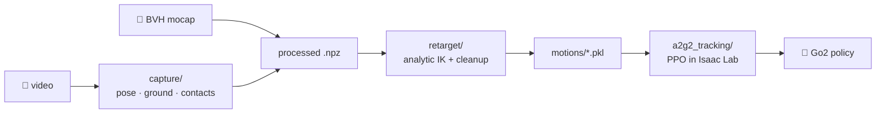

# dog2go2

**Teach a Unitree Go2 to move like a dog — starting from a video of one.**

dog2go2 is a full pipeline from *footage of a real animal* to a *trained motion
policy on a quadruped robot*: it lifts the dog's 3D pose from monocular video,
places it in a metric world, retargets the motion onto the Go2 with analytic
IK, and then trains a DeepMimic-style PPO policy in Isaac Lab to reproduce it
under real physics.



Two ways in — video or BVH mocap — meeting at one npz contract; everything
downstream is shared. The full engineering log (every phase, every trap, every
number) lives in [CHANGELOG.md](CHANGELOG.md); training runs are chronicled in
[RESULTS.md](RESULTS.md).

## Quick install

Requires [uv](https://docs.astral.sh/uv/) and Python ≥ 3.11.

```bash
git clone <this repo> && cd dog2go2
uv sync
```

That is enough for the retargeting half (MuJoCo, pure numpy IK, rendering).
The two perception/RL halves each need their own environment:

| what | needs | where |
|---|---|---|
| `capture/` (video → motion) | torch, detectron2, transformers, pytorch3d + the 8.35 GB [AniMer](https://github.com/luoxue-star/AniMer) checkpoint | `$PY_CAPTURE` interpreter |
| `a2g2_tracking/` (RL) | Isaac Lab v2.3.1, Isaac Sim 5.1.0 | its own venv |

```bash
export A2G2_SSD=/path/to/bulk/storage          # data, weights, logs, caches
export PY_CAPTURE=$HOME/anaconda3/envs/animal/bin/python
export ANIMER_CKPT=/path/to/AniMer/checkpoint.ckpt
```

Setup details for both are in the
[CHANGELOG](CHANGELOG.md#setup) and
[a2g2_tracking/README.md](a2g2_tracking/README.md). The Go2 model
(MuJoCo Menagerie, BSD-3) and AniMer's `amr` package (MIT) are vendored.

## From Video to Policy

### 1 · Capture — video in, motion out

```bash
capture/run_default.sh media/dog_3.mp4 dog_3
```

One command, eight stages: AniMer SMAL pose per frame → ground plane from
metric depth → foot contacts → bundle-adjusted world placement → npz contract
→ analytic IK retarget → Go2 render → side-by-side video. It ends at
`motions/dog_3.pkl` and `media/sbs_dog_3.mp4` — watch the side-by-side; it is
the one artifact that can't lie. Stages resume: re-running skips anything
already produced.

> [!IMPORTANT]
> **Your video must show the ground plane.** The pipeline recovers the world
> from the floor: a metric-depth model fits the ground plane, whose normal
> defines *up*, whose distance gives the camera height that anchors every
> metre, and against which foot contacts are detected. No visible ground → no
> plane to fit → no scale, no contacts, no world placement. Related caveat:
> AI-generated footage has no real geometry for the depth model to measure —
> expect its metric scale to be off by tens of percent.

### 2 · Retarget — motion in, joint trajectories out

`run_default.sh` already did this, but each half stands alone:

```bash
uv run python retarget/retarget.py $A2G2_SSD/work/capture/processed/dog_3.npz
MUJOCO_GL=egl uv run python viz/playback.py motions/dog_3.pkl        # render
uv run python viz/playback.py motions/dog_3.pkl --interactive        # live viewer
```

A rigid trunk frame is fitted to the dog, feet are re-anchored to the Go2's
leg geometry, and a closed-form 3-DOF leg IK (pure numpy, vectorized) solves
every frame — followed by contact refinement, smoothing, ground alignment,
foot-skate removal, and feasibility projection. Output pkls are 50 Hz and
carry root pose, joint angles, and contact labels.

### 3 · Track — train the policy in Isaac Lab

```bash
source $A2G2_SSD/venvs/env_isaaclab/bin/activate

# reference foot-position caches for the end-effector reward (once per clip)
python a2g2_tracking/scripts/gen_feet_cache.py --headless

# train (8192 envs, ~150k steps/s on an RTX 3090), then film the result
python a2g2_tracking/scripts/rsl_rl/train.py \
    --task Template-A2g2-Tracking-Direct-v0 --headless --max_iterations 6000
python a2g2_tracking/scripts/rsl_rl/play.py \
    --task Template-A2g2-Tracking-Direct-v0 --num_envs 32 --video
```

The task tracks the reference with an 8-term DeepMimic reward, reference
state initialization, early termination, and domain randomization; the clip
set is configured in the env cfg (`env.motion_files=[...]` overrides it per
run). Multiple clips train into **one policy** — no clip ID in the
observations, disambiguation flows through the reference preview.

## Smoke tests — mocap → RL

Each layer has a cheap check that it still works, runnable in order:

```bash
# 0 · unit tests: IK round-trip, npz contract, capture numerics (no GPU)
uv run pytest tests/

# 1 · the robot model: joint table + a sweep video in media/
MUJOCO_GL=egl uv run python viz/smoke_test_go2.py

# 2 · the mocap path end to end (download the dataset first, see CHANGELOG)
uv run python retarget/parse_mocap.py data/D1_007_KAN01_001.bvh
uv run python retarget/retarget.py data/processed/D1_007_KAN01_001.npz
MUJOCO_GL=egl uv run python viz/playback.py motions/D1_007_KAN01_001.pkl

# 3 · the RL env, no policy: kinematic replay must be clean before training
python a2g2_tracking/scripts/rsl_rl/play.py \
    --task Template-A2g2-Tracking-Direct-v0 --replay \
    --motion D1_007_KAN01_001 --headless --video

# 4 · training loop sanity: a short run must show reward climbing
python a2g2_tracking/scripts/rsl_rl/train.py \
    --task Template-A2g2-Tracking-Direct-v0 --headless --max_iterations 100
```

If step 3's replay skates or floats, fix the motion before ever training on
it — the replay gate exists because a policy will happily learn a broken
reference.

## Going deeper

- [CHANGELOG.md](CHANGELOG.md) — the full build log: every phase of the
  retargeting pipeline, the capture migration, and the traps that cost real
  debugging time.
- [RESULTS.md](RESULTS.md) — every training run, one change per run, with
  eval numbers and post-mortems.
- [a2g2_tracking/README.md](a2g2_tracking/README.md) — RL stack, measured
  constants, and the train/replay workflow.

## Licenses

Code in this repo is the author's. Vendored: Unitree Go2 model from
[MuJoCo Menagerie](https://github.com/google-deepmind/mujoco_menagerie)
(BSD-3), AniMer's `amr` package (MIT). The AI4Animation dog mocap dataset
(CC BY-NC 4.0) and the SMAL model files are **not** redistributed here.
